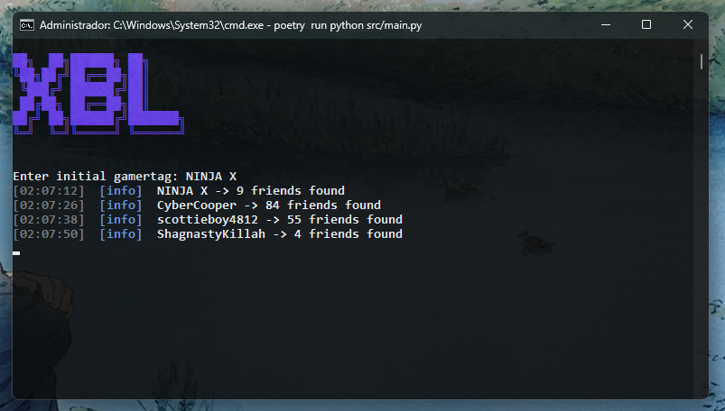

# XBLScrapper  
XBLScrapper is a Python tool for collecting a list of friends from an initial gamertag on Xbox Live (Xbox Network).



## Prerequisites  
- Python 3.13 or newer  
- Poetry installed ([Installation Guide](https://python-poetry.org/docs/#installation))  

## Installation & Usage  
1. Open a terminal and navigate to the project directory:  
```bash
cd /path/to/XBLScrapper
```
2. Install dependencies using Poetry:
```bash
poetry install
```
3. Run the script with:
```bash
poetry run python src/main.py
```

## License
This project is licensed under the MIT License - see the [LICENSE](LICENSE) file for details.
